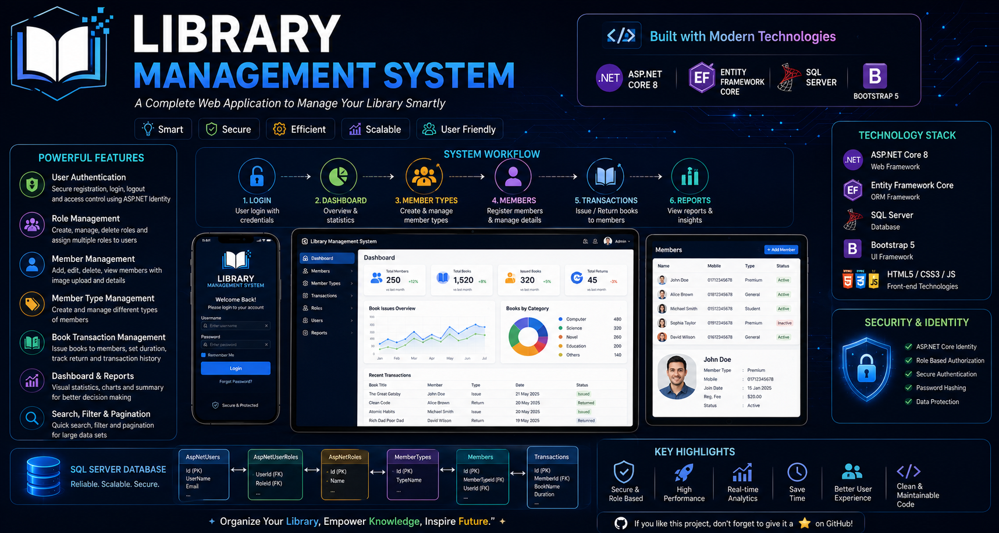

# 📚 Library Management System

<p align="center">

### **A Modern, Secure & Scalable Library Management System**

Built with **ASP.NET Core 8 MVC**, **ASP.NET Core Identity**, **Entity Framework Core**, and **SQL Server**.

---



</p>

---

## ✨ Overview

Library Management System is a modern web application designed to simplify library operations through a secure and user-friendly interface.

The application provides complete member management, role-based authentication, transaction management, reporting, and dashboard analytics using Microsoft's latest development technologies.

---

# 🚀 Key Features

### 🔐 Authentication & Security

* ASP.NET Core Identity
* User Registration
* Secure Login & Logout
* Role-Based Authorization
* Cookie Authentication
* Password Hashing
* Access Denied Handling

---

### 👥 Member Management

* Add Member
* Edit Member
* Delete Member
* View Details
* Upload Member Photo
* Active / Inactive Status
* Registration Fee
* Join Date
* Mobile Validation

---

### 🏷 Member Type Management

* Create Member Types
* Edit Member Types
* Delete Member Types
* Assign Member Types

---

### 📚 Transaction Management

* Create Transactions
* Member-wise Transactions
* Book Duration
* Issue Records
* Return Records
* Transaction History

---

### 📊 Dashboard & Reports

* Dashboard Overview
* Statistics
* Reports
* Analytics
* Recent Activities

---

### ⚡ Smart Features

* Image Upload
* Pagination
* Search
* Filtering
* Validation
* Responsive UI
* Clean Architecture
* Dependency Injection

---

# 🏗 System Workflow

```text
Login
   │
   ▼
Dashboard
   │
   ├────────────► Member Types
   │
   ▼
Members
   │
   ├── Create
   ├── Edit
   ├── Upload Image
   ├── Registration Fee
   └── Status
   │
   ▼
Transactions
   │
   ├── Book Issue
   ├── Duration
   ├── Return
   └── History
   │
   ▼
Reports & Analytics
```

---

# 🏛 Project Architecture

```text
Browser
    │
    ▼
ASP.NET Core MVC
    │
    ├── Controllers
    ├── Views
    ├── Models
    ├── ViewModels
    │
    ▼
Business Logic
    │
    ▼
Entity Framework Core
    │
    ▼
SQL Server
```

---

# 🛠 Technology Stack

| Category       | Technology               |
| -------------- | ------------------------ |
| Framework      | ASP.NET Core 8 MVC       |
| Language       | C#                       |
| ORM            | Entity Framework Core    |
| Authentication | ASP.NET Core Identity    |
| Database       | SQL Server               |
| Frontend       | HTML5, CSS3, Bootstrap 5 |
| Client Script  | JavaScript               |
| IDE            | Visual Studio 2022       |

---

# 📂 Core Modules

* Authentication
* Role Management
* Member Management
* Member Type Management
* Transaction Management
* Dashboard
* Reports
* Image Upload
* Validation

---

# 🗄 Database

Main Tables

* AspNetUsers
* AspNetRoles
* AspNetUserRoles
* Members
* MemberTypes
* Transactions

Relationship

```text
MemberTypes
      │
      ▼
Members
      │
      ▼
Transactions
```

---

# 🔐 Security

* ASP.NET Core Identity
* Role-Based Authorization
* Cookie Authentication
* Password Hashing
* Model Validation
* Anti-Forgery Protection

---

# 📸 Screenshots

| Login                | Dashboard                |
| -------------------- | ------------------------ |
| Add login screenshot | Add dashboard screenshot |

| Members               | Transactions               |
| --------------------- | -------------------------- |
| Add member screenshot | Add transaction screenshot |

---

# 🚀 Getting Started

```bash
git clone https://github.com/yourusername/Library-Management-System.git
```

Open the project using **Visual Studio 2022**.

Configure SQL Server.

Run

```bash
Update-Database
```

Press

```text
F5
```

---

# ⭐ Highlights

* Modern UI
* Secure Authentication
* Clean Architecture
* Role-Based Access
* EF Core
* SQL Server
* Scalable Design
* Responsive Layout

---

# 👨‍💻 Developer

**MD. ENAMUL HAQUE**

MS in Statistics
University of Dhaka

---

## ⭐ Support

If you like this project, consider giving it a **⭐ Star** on GitHub.

> **"Organize Your Library, Empower Knowledge, Inspire Future."**
